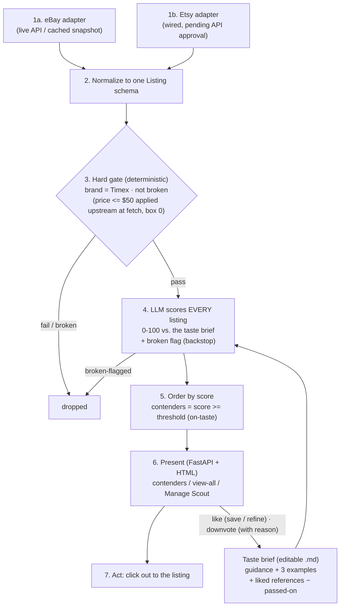
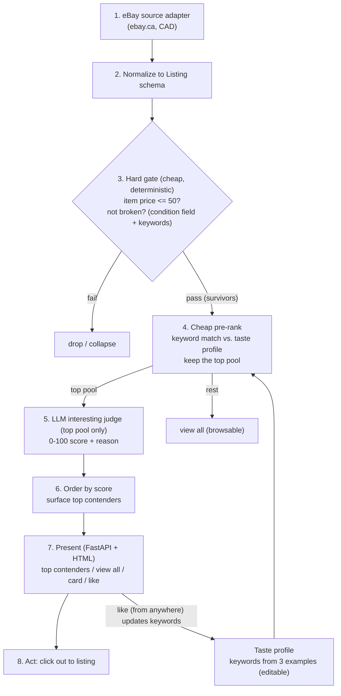

# Vintage Timex Scout: Build Plan

A triage tool that turns scattered, high-volume marketplace listings into a short, ranked, explained shortlist of vintage Timex watches worth a collector's attention, filtered to budget, condition, and taste.

> **Brief, in one line:** build a tool that syncs active listings, surfaces ones that match my preferences (under $50 total including shipping, not explicitly broken, interesting), and highlights purchase candidates.

This document is the plan: what we are building, why, and how. It is also the running record of the decisions behind the scope (Appendix A).

## Contents

1. [Problem](#1-problem)
2. [Jobs To Be Done](#2-jobs-to-be-done)
3. [Goals and Success Criteria](#3-goals-and-success-criteria)
4. [Scope: the MVP Cut-Line](#4-scope-the-mvp-cut-line)
5. [Requirements](#5-requirements)
6. [Design Considerations](#6-design-considerations)
7. [System Design](#7-system-design)
8. [Tech Stack](#8-tech-stack)
9. [User Story Map: Now / Next / Later](#9-user-story-map-now--next--later)

Appendices: [A. Decision Log](#appendix-a-decision-log-scope-rationale) · [B. Marketplace Assessment](#appendix-b-marketplace-assessment) · [C. Original System Flow (v1)](#appendix-c-original-system-flow-v1)

---

## 1. Problem

Vintage Timex is abundant and cheap, so the problem is not scarcity. It is volume, scatter, and repetitive judgment.

* **Scatter.** Listings are spread across eBay, Etsy, and others. Each site gets checked by hand, separately, repeatedly.
* **Volume and noise.** We expect many listings, and assume a large share are irrelevant, overpriced, or broken. The few worth attention are buried.
* **Judgment load.** Taste is implicit and hard to state, so triage is manual work repeated listing by listing.

The collector has no single view of worth-buying listings across marketplaces. Keeping up means manual cross-site checking, sifting high-volume noise, and judging each listing against fuzzy taste, which wastes time and risks missing or misjudging a good piece.

**What the product does.** It collapses multiple marketplaces into one explained shortlist of top contenders, filtered to budget, condition, and taste. The MVP proves the full pipeline (pull, filter, judge, surface, act) on a single marketplace, eBay; more sources follow (see Scope).

**Why Timex only.** We are solving for one person, and that person collects Timex, so other brands are irrelevant.

---

## 2. Jobs To Be Done

These are the collector's real jobs: what the person has to do today, by hand.

1. **Discover.** Go to multiple marketplaces and search for new Timex listings.
2. **Triage.** Apply judgment and taste to find the pieces that are relevant and interesting, sift past the irrelevant, overpriced, and broken.
3. **Stay current.** Keep watching for new and relisted pieces over time, so good ones are not missed.
4. **Act before it is gone.** Move quickly on the best opportunities before someone else does.

---

## 3. Goals and Success Criteria

> **Where the value lives.** The marketplace integration, the hard gate, and adjustable filters are low-risk and largely deterministic, the easy part. The make-or-break is the quality of the interestingness ranking: for every 100 listings, can it pinpoint the one or two worth attention without losing the ones the user would have wanted? That quality is the whole point of the tool, and the bar the MVP must clear. Everything else is plumbing in service of it.

The MVP is "working" if the tool:

1. Surfaces a small set of top contenders, ordered by the LLM's interestingness score, with the full gated set available to browse on demand. (How the score is produced is in System Design, boxes 4 to 6.)
2. Applies the hard filters correctly and checkably: budget by item price (at or under $50), and excludes everything explicitly broken (a dead battery is fine).
3. Orders the contenders sensibly against the ground truth: pieces resembling the three example watches land near the top, and clearly irrelevant or junk listings do not.
4. Makes the reason for each pick clear to the user. The form this takes (a one-line reason, a badge, a pill, a highlight) is a UI choice, decided later.

**Defining and evaluating "interesting."** The definition is explicit and inspectable: it is the 'Taste Brief', built from the three example watches, the project brief and updated by likes. Judging how well it surfaces is unavoidably subjective, so the MVP bar is a reasonable ranking, sanity-checked by eye against the ground-truth set, not a formal accuracy metric. The learning loop is built in the MVP, but proving it measurably improves quality over time is not a hard MVP success bar.

**Budget is total landed cost.** Per the brief, the gate is on **total cost: item price + shipping to M6K1V8 ≤ $50** (D28). Shipping comes from the eBay Browse API's `shippingOptions`, requested for M6K1V8 via the end-user-context header (no extra calls); free shipping is $0, and an item with no shipping quote is kept on item price and flagged "shipping not listed" (D6, favor recall). Only FX normalization for non-CAD sources stays deferred (D19), since ebay.ca is already CAD.

**Ground truth (taste seed):** the three watches in the brief.
`ebay.ca/itm/377073705816`, `ebay.ca/itm/117111976291`, `etsy.com/ca/listing/4469739360`.

---

## 4. Scope: the MVP Cut-Line

Mapped to the jobs in Section 2, the MVP serves Discover, Triage, and a path to Act. Stay current (awareness and tracking) is deferred: the first priority is making sure the tool surfaces quality insights here and now; notifications and tracking can be layered on afterward.

**In (Now):**
* Timex only.
* eBay live, single marketplace (ebay.ca, prices in CAD).
* On-demand pull.
* Map listings into one shared format (the `Listing` schema; explained in System Design).
* Hard gate: **total landed cost (item price + shipping to M6K1V8) at or under $50**; exclude explicitly broken (a deterministic check on the listing's stated condition field and keywords like "for parts").
* Taste: an editable natural-language **taste brief** (markdown) that the LLM reads, holding the brief's guidance + the three example watches + watches you like and dislike. Editable by hand.
* Interestingness judgment: the LLM scores **every** gated listing 0–100 against the taste brief, with a reason for the contenders. *(Revised from scoring only a keyword-selected top pool, D33; once volume measured manageable and the thinking-off Flash judge was cheap and fast, scoring all was feasible and more accurate.)*
* Learning loop: liking or passing on a watch (from anywhere) updates the taste brief; you **Reapply** to re-score the batch. *(Re-scoring is batched on demand, not live per click: D39, a cost decision, and the loop still "improves with use," applied deliberately.)*
* Top contenders surfaced, with option to view all.
* Link out to the original marketplace listing (the user buys there, not in the tool).

**Out (deferred, reasons logged in Appendix A: Decision Log):**
* Additional marketplaces, Etsy included (Later, after higher-priority single-source work; prove one platform first). See Appendix B: Marketplace assessment.
* Chrono24 (wrong inventory, no API; do not build).
* Option to select other brands: the tool is built specifically for the nuance of Timex watches (see D23).
* Heavier personalization: "For You" model from accumulated up/down signal are deferred. *(Negative signal, a downvote, was originally deferred but is now in the MVP: it adds a soft, reasoned, editable "Passed on" note to the taste brief. See D16/D35.)*
* Notifications and change-detection.
* Piece-history.
* Currency normalization for multi-currency sources (ebay.ca is CAD, so the MVP needs none). *(Landed cost, item + shipping to M6K1V8, is now IN the MVP per the brief; see D28.)*
* Shipping-cost estimator.
* Full persistence layer / datastore: lets the tool remember listings across pulls over time (recognize new vs. already-seen) and power awareness/alerts. The MVP keeps only the taste profile, in a lightweight store.
* Automated scheduled pulls at a configurable frequency, for example daily or weekly (the MVP pulls on demand).

> **MVP is the thinnest slice that does the whole job end-to-end** (source, gate, judge, present, act, learn) for one brand, one live source, on demand. Everything deferred was cut for an explicit reason (value, effort, or unresolved unknowns), not for lack of time.

### Non-Goals (deliberate, not oversights)
* **Single user.** This is a tool for one collector (the person in the brief), not a multi-user product. No accounts and no per-user data separation.
* **No login or security hardening.** The setup is single-user and low-risk. The only sensitive field is a shipping postal code, and it is hard-coded (M6K1V8), so authentication, sessions, and access control are out of scope.
* **Not a commercial product.** Not built to resell, re-skin, or deploy for others. Every decision optimizes for one collector's value, not for generality.
* **Not a polish or design exercise.** The UI is deliberately simple. Effort goes into the core value (surfacing quality recommendations), not visual styling or refinement. Polish is not the point of this project.

---

## 5. Requirements

### Functional (pipeline spine: source, filter, decide, present, act, learn)
| ID | Requirement |
|----|-------------|
| FR-1 | **Source.** Pull active Timex listings from eBay (live API) and normalize into one `Listing` schema. The schema and adapter design keep additional sources pluggable (Etsy and others come later). |
| FR-2 | **Budget basis: total landed cost.** The gate is on **item price + shipping to M6K1V8 ≤ $50** (the brief's requirement), from a single CAD source (ebay.ca). Shipping comes from the Browse API `shippingOptions`, requested for M6K1V8 via the `X-EBAY-C-ENDUSERCTX` header; a missing quote is kept on item price and flagged (D6/D28). FX normalization for non-CAD sources stays deferred (D19). |
| FR-3 | **Gate (deterministic, yes/no).** Two pass/fail checks, no model judgment: is **total landed cost (item + shipping) at or under $50**, and is the listing free of explicit broken signals (structured condition field plus keywords; a dead battery is fine)? Fail either and the listing is dropped. |
| FR-4 | **Decide (interesting).** The LLM scores **every** gated listing 0–100 against a natural-language **taste brief** (the brief's guidance + the 3 example watches + liked watches), and writes a one-line reason for the contenders. No keyword pre-check selects a pool: at the measured volume (~420) the LLM scores them all. *(Revised: the original design used a keyword pre-rank to cap an LLM pool; once volume turned out low we moved scoring entirely to the LLM. The keyword pre-rank survives only as the no-LLM fallback and a volume guard. See D33.)* |
| FR-5 | **Present.** Top contenders in a web UI, with an option to view all gated listings (the over-$50 and broken ones are already dropped). Each card shows hero image and gallery (loaded from the marketplace's URLs, not stored), title, item price, stated condition, interest score with reason, and link. |
| FR-6 | **Act.** Click through to the original listing. |
| FR-7 | **Learn.** Liking a watch (from anywhere, including view-all) extracts its keywords into the taste profile and re-ranks; the profile is also editable by hand. |

### Non-functional (the differentiators)
| ID | Requirement |
|----|-------------|
| NFR-1 | **Explainable**, at two altitudes. *Per item:* every surfaced piece carries a human-readable reason naming the specific taste signals that earned its score (e.g. "NOS, boxed, advertising dial"), never the price, since every listing is already gated ≤ $50. *Per system:* the Manage Scout tab carries a "How a score is decided" rule-brick: the 0–100 rubric bands (90–100 standout, 70–89 on-taste, 40–69 ordinary, 0–39 off-taste) and the signals the Scout weighs, so the user has a mental model for why any score landed where it did. |
| NFR-2 | **Cost-aware.** Source-side filters and the deterministic gate cut volume before the LLM. The LLM then scores the gated set with a cheap Flash-tier model, *thinking disabled*, in a two-pass design (scores for all, reasons for the few); a full re-score is ~$0.02–0.03. Critically, **taste edits don't auto-re-score** (D39): likes/passes/edits are queued and applied in one batched **Reapply**, so a curation session costs one re-score, not one per click. A keyword pre-rank remains a cost guard if volume ever spikes past `MAX_LLM_SCORE`. See "LLM cost & token budget" in §7. |
| NFR-3 | **Resilient.** A source failing degrades gracefully and the demo still renders; once there are multiple sources, one failing never breaks the others. |
| NFR-4 | **Extensible.** Adding another marketplace later is a small, contained job: write one converter that turns its listings into the shared format the rest of the tool already uses, and nothing else has to change. |
| NFR-5 | **Honest.** Uncertainty (low confidence, unknown condition) is shown, not hidden. |

---

## 6. Design Considerations

Open constraints and tradeoffs that shaped the design. The mechanism itself is in Section 7.

**Volume and cost are unknown until we measure.** Vintage Timex is assumed abundant, so a single pull may return hundreds or thousands of listings, unconfirmed until eBay is wired. LLM cost scales directly with how many listings reach the judge, so per-run cost is also unproven. Two consequences: the design handles large result sets from day one (cap per source, surface top contenders, paginate the rest), and the gate-then-pre-rank funnel exists to keep the LLM off the full volume (plus a cheaper text model for the MVP judge, and vision deferred as the most expensive step). The pre-rank is a hedge under the assumption that volume is high; on the first live pull we record real counts and cost and revisit, including whether the pre-rank is needed at all if volume turns out low.

> **Measured (2026-06-19).** A single "vintage timex watch" search on ebay.ca returns **10,000+** results: volume is real, and high. This confirmed the funnel and added a step in front of it: **source-side filtering (box 0)**. We push eBay's own native filters into the query (category = Wristwatches, item price ≤ $50, exclude "for parts/not working") so ~10,000 collapses to a bounded, relevant, deduped ingest (~400 across a few model-line queries) *before* a single listing reaches our code. 

**Noise reduction is the core job.** The deterministic gate (price, condition) is the primary volume control. It runs before the UI renders and before any LLM call, so neither the user nor the token budget ever sees anything but survivors.

**Lead with the few; hide nothing.** The UI surfaces a small set of top contenders and keeps the full gated set one click away ("view all"). Only the gate removes listings; the LLM score merely orders what is left, so a low score never buries a watch for good.

**The learning loop is in the MVP, and demoable without persistence.** Liking a watch updates the taste brief; you Reapply to re-score, in one session, in memory, so the ranking visibly improves with use and the demo's centerpiece needs no datastore. *(Re-scoring is batched on demand rather than live-per-click: a cost decision, D39.)*

**Listing staleness.** Listings sell or expire and should stop being shown. In the MVP this is automatic: each run is a fresh pull, so only currently-active listings appear and stale ones do not return.

---

## 7. System Design

This is the MVP pipeline, end to end. **This is version 2:** the architecture evolved as we measured real volume and refined the taste model. The original v1 funnel is preserved in [Appendix C](#appendix-c-original-system-flow-v1); "what changed" is summarized below the diagram.

**Version 2: what changed from the original (v1, Appendix C):**
- **Two sources, not one.** eBay (live API or cached snapshot) **+ Etsy** (wired, pending API approval). Re-pull fans out to both, each emits the same `Listing`, and one source failing never breaks the other (NFR-3). A tri-state source dot shows each: 🟢 live / 🟡 keys-set-but-not-live / 🔴 no key.
- **LLM scores everything; the keyword pre-rank left the critical path.** Volume measured low (~420 gated), so the LLM judges *every* gated listing against a **natural-language taste brief** instead of a keyword profile feeding a small top pool (D33). The keyword pre-rank survives only as a no-LLM fallback / cost guard.
- **The gate is brand + not-broken** (price is filtered upstream at fetch, box 0), and not-broken is now **two-layer**: deterministic keywords *plus* an LLM `broken` flag backstop (D34, BUILD_JOURNAL Entry 17).
- **Contenders by a justified score threshold** (the rubric's on-taste floor), not a fixed pool size (D36), and nothing is hidden, since every listing is ranked in "View all".
- **Two-directional, reasoned learning:** likes (save vs. refine) and downvotes (with an optional reason) edit the taste brief (D35–D37), managed on a dedicated **Manage Scout** tab.

**The spine: cheapest cut first.** Each stage costs more than the one before it, so each only ever sees what the cheaper stage upstream already cleared: **source-side filters (box 0) → deterministic gate → LLM judge**. eBay's native filters bound the 10,000+ result set before ingest, the gate removes the rest of the junk for free, and only the small, clean survivor set reaches the model. Every source emits the same `Listing`, so adding a marketplace later is one converter, not a rewrite. Each stage is detailed below.

### Listing schema (normalized)
Each marketplace returns its data in its own format. "Normalizing" means converting every source into one shared record (the `Listing`) with the same fields, so everything downstream (the gate, the judge, the UI) deals with one format and does not care which marketplace a listing came from. The record:
`source`, `id`, `url`, `title`, `raw_condition` (structured plus free text), `price` plus `currency`, `shipping_cost` (to M6K1V8, for the landed-cost gate), `item_location`, `images` (URLs, not stored files), `seller`, `listing_end`, `listed_at`, `raw` (debug blob).
Added downstream: `working_status`, `disclosed_damage`, `interest_score`, `reason`. (`landed_cost_cad` is reserved for future FX normalization, D19.)

### How the gate works (FR-3)
The gate is three deterministic yes/no checks: **brand** (must be a Timex; D34, since eBay's fuzzy search leaks a Seiko/Lorus Mickey-Mouse watch), **budget** (landed cost, item + shipping, ≤ $50), and **not-broken** (structured condition field says non-working/for-parts, or the text has obvious broken keywords). A dead battery is fine, so "needs a battery" listings pass. Since box 0 already caps item price at fetch, in practice the gate is mostly doing the **brand + not-broken** work; the budget check stays as a defensive backstop and to catch shipping that pushes a cheap item over $50.

**How shipping is priced (to M6K1V8).** We don't estimate shipping ourselves; we ask eBay to quote it to the buyer's location. Every eBay request carries a header, `X-EBAY-C-ENDUSERCTX: contextualLocation=country=CA,zip=M6K1V8` (built from `SHIP_TO_POSTAL` in config), so eBay returns each listing's shipping cost *to that postal code*. For flat or free shipping that figure is fixed (free = $0); for **calculated** shipping (rate varies by buyer location) the header is what makes eBay compute the real cost to M6K1V8. We take the cheapest `shippingOptions` entry as `shipping_cost`, and `landed_cost = item price + shipping_cost`. If eBay returns no quote (local pickup, or a calculated listing it won't price), `shipping_cost` is `None`: the item is kept on its item price and flagged "shipping not listed" (D6). The address is a single hard-coded postal code (single-user tool, D22).

**Two-layer not-broken (the deterministic gate alone is too brittle).** A real bug surfaced this: deterministic keyword matching has endless gaps: it missed "Runs **4** Repair" (texting shorthand for "for repair") and "run**/**stop" (slash-separated "runs then stops"), so broken watches reached the contenders. Fix is two layers: (1) the deterministic gate, with an expanded pattern set, drops the obvious cases cheaply *before* any LLM call; (2) the **LLM scoring pass also returns a `broken` flag** (it reads the same listing and understands "Runs 4 Repair", "project watch", etc. natively), and anything it flags is removed entirely (a broken watch must never be a contender, FR-3). A dead/needs-battery is still fine in both layers. This is the E10 "LLM battery-vs-broken nuance" promoted from Later into the MVP, cheaply, because the LLM already scores every listing.

### How the interestingness ranking works
This is the one place AI ranks. The LLM reads the taste brief (detailed in "The taste system" below) and scores every gated survivor:

1. **Gate (no AI):** Timex, not broken, in budget (~420 survivors).
2. **LLM scores all:** each gets a 0–100 alignment score against the taste brief, catching what keywords miss (an unlisted collab, a characterful dial, "deadstock" phrased ten ways).
3. **Order and surface:** by score, tie-break cheaper-first. **Contenders = score ≥ a threshold** (not a fixed count), so the count reflects how many are genuinely on-taste; the rest stay in "view all".

**Refining the LLM judge (tradeoffs).** Scoring ~420 listings in real time forced three design choices, worth recording:
* **Two passes: a fast bulk scan, then a self-justifying re-judge.** Producing a 0–100 score *and* a written reason for all 420 is dominated by the reason text (output tokens), which is slow. So **pass 1 asks for scores only** (tiny output → all listings scored in a few big concurrent batches), but this is treated as an *approximate candidate filter*, not the final word. **Pass 2 re-judges the contender candidate pool** (everyone scored within a margin of the bar) with a single combined call that returns *both* a reconciled score *and* the specific signal behind it. The pipeline thresholds on that reconciled score. This is what makes a surfaced score trustworthy: the model has to *name the signal* to justify the number, so a generic listing it can only describe as "generic" also scores below the bar and never reaches the standout tier. The two passes can't disagree on anything surfaced; see the "90 · generic" bug in Entry 20 of the build journal, which is exactly what this design closes. The trade: non-contenders far below the bar show a bulk score without a one-line reason.
* **Thinking off** (`thinkingConfig.thinkingBudget = 0`). The single biggest speed lever: it cut a full ~420-listing score from ~90s to ~15s. *(What "thinking" is and why disabling it is safe here: see "LLM cost & token budget" below.)*
* **Taste edits are queued, not auto-applied (D39).** A like, pass, or brief edit updates the taste brief *instantly* (a file write, no LLM) and marks the scores "stale"; the ~390 listings are re-scored only when the user clicks **Reapply taste**. This batches a whole curation session (40 likes/passes) into **one** re-score instead of 40, the single biggest token-cost lever in normal use (see "LLM cost & token budget" below). A full pull (Fetch Listings) and Reapply are the only two paths that spend scoring tokens.

(An LLM scoring listings against a rubric is "LLM-as-judge"; here the rubric is the natural-language taste brief.)

### LLM cost & token budget (NFR-2)
Cost-awareness is a first-class design constraint here, not an afterthought: the tool is meant to be run and re-run, and a naive "re-score on every interaction" design burns tokens fast. The model is **Gemini 2.5 Flash** with thinking disabled.

**What one full re-score (~390 gated listings) costs.** Three passes (see above): pass 1 scores all (~10.6k in / 4.6k out), pass 2 confirms the candidate pool of ~60 (~2.5k in / 1.8k out), pass 3 writes the granular breakdown for the ~8 contenders (~1k in / 1.1k out), roughly **~14k input + ~7.5k output tokens**. At Gemini 2.5 Flash list prices (~$0.30 / 1M input, ~$2.50 / 1M output, *verify current rates*) that is **≈ $0.02–0.03 per full re-score**. The on-demand "Explain in detail" for a single view-all listing is ~1k in / 1.1k out ≈ **$0.003**.

**Why the batched-reapply design matters (D39).** The dominant cost driver is *how often* we re-score, not the per-score price:

| Action | Old (auto re-score) | New (D39, batched) |
|---|---|---|
| Like / pass / brief edit | ~$0.02 **each** (full re-score) | **$0** (file write; queued) |
| Curate 40 listings in a session | ~40 × $0.02 ≈ **$0.80** | 1 Reapply ≈ **$0.02** |

That is a **~40× reduction** for a typical curation session: the user can shape the brief freely and pay for exactly one re-score when they choose to apply it.

**The levers, in order of impact:**
1. **Thinking disabled** (`thinkingBudget = 0`). By default the model writes a private chain of reasoning *before* it answers (its "thinking"), which helps on hard multi-step problems but is wasted effort on a bounded scoring task: rate a short listing against a rubric, no reasoning chain required. Turning it off skips that step, and a full score dropped from ~90s to ~15s, with the token/compute spend cut proportionally and no meaningful loss in ranking quality. The single biggest lever: it's what made "score every listing" fast enough to be practical.
2. **Batched reapply (D39).** N taste edits cost one re-score, not N.
3. **Two-pass design.** The expensive full-set pass emits scores only (tiny output); reasons/breakdowns run on the small pool, not all ~390.
4. **On-demand detail.** The granular breakdown is precomputed only for the ~8 contenders; everything else is explained lazily, only when its modal is opened.
5. **`MAX_LLM_SCORE` volume guard.** If a pull ever returns thousands, the keyword pre-rank caps what reaches the LLM.

**On the ~$5 spent to date:** that is almost entirely *development* iteration: many full pulls while building, the taste-extraction step, and (early on) runs *before* `thinkingBudget = 0` and batched reapply existed, which were several times more expensive each. In steady single-user operation, a session is a Fetch plus a Reapply or two, a few cents.

### The taste system, and why it changed (the heart of the product)
Getting "interesting" right is the whole point of the tool, so the taste model is worth its own summary. It went through three deliberate moves, each logged in the decision log and BUILD_JOURNAL:

1. **Keyword pre-rank → LLM scores everything (D33).** The original plan scored listings with a keyword profile and only sent a small top pool to the LLM, to bound cost while volume was unknown. Once measured (~420 after the gate), volume was low enough that the keyword proxy was unnecessary *and* less accurate, since keywords miss meaning (an unlisted collab, "deadstock" phrased ten ways). So the LLM now scores **every** gated listing, and keywords survive only as a no-LLM fallback / cost guard. The judge is the make-or-break; spend it here.

2. **Keyword profile → an editable taste *brief* (D33).** Taste is no longer a hidden weighted keyword list but a **natural-language markdown brief** the user can read and edit: the brief's guidance (collabs, deadstock, vintage models), the three example watches, and references/passes the user adds. It is the explicit, inspectable rubric D4 always wanted, just in prose. This is what the LLM reads to score.

3. **Two-directional, reasoned learning (D35–D37).** The brief learns from use: **liking** a watch (with a save-vs-refine choice, D37) adds it as a positive reference; **downvoting** (with an optional reason, D35) adds a soft, editable "Passed on" note so the model rates similar pieces lower without the user fearing it will mis-learn *why*. Both are managed on the **Manage Scout** tab, both re-score, and neither ever hard-excludes (D16). The reason-capture on downvotes is the key safety valve against attribution errors: the user states the why, the model doesn't guess.

The throughline: **the definition of taste is a document the user owns and can see**, the LLM applies it to everything, and the user shapes it with reasoned positive and negative signal.

---

## 8. Tech Stack

The stack, one bullet per layer:

* **Language: Python.** Runs every step: calling the marketplace APIs, the gate, the LLM, and serving the web page. Chosen because eBay and Etsy have well-documented Python access and Python is the standard for working with LLMs.
* **Web framework: FastAPI.** A Python tool for a small web server: it takes the request when the page opens and sends back the listings to display. Chosen for minimal setup and a fast path to a working page.
* **Front end: server-rendered HTML.** Python assembles the finished HTML and hands it to the browser, so there is no separate front-end framework to build or maintain. Chosen as the simplest possible demo UI.
* **Data sources: eBay Browse API (live), Etsy Open API v3 (wired, pending).** The official channels to pull listings programmatically instead of scraping. eBay uses a client-credentials app token (the app authenticates as itself, no per-user login) and is **live**: the production keyset is approved (account-deletion exemption auto-granted), and a Fetch pulls ~670 real Timex listings, each enriched with its full description + item specifics via `getItem` (D41). Etsy uses an API key and is wired pending its own approval. *(During the eBay approval wait, a browser-capture fixture stood in (D30); it's now the fallback, not the source.)*
* **LLM: the judge, Google Gemini (Flash tier), provider-agnostic.** Scores every gated listing 0–100 against the taste brief, with reasons for the contenders; the mechanism (two-pass, thinking-off, cost) is in §7. Text-only: it reads each listing's enriched eBay item specifics + description (D41), not the photos (vision deferred, D13). Written against a `Judge` interface (Gemini, Claude, or a no-LLM keyword fallback) picked by whichever API key is present; any LLM error degrades to the keyword judge so the demo always renders (NFR-3). Flash tier because the judge is a bounded text-scoring task, not deep reasoning (the why is in §7; D31). Gemini is the default to reuse an existing key; switching to Claude is a one-line change.
* **State: lightweight, mostly in-memory.** Two small files in `state/`: the **taste brief** (`taste.md`, so taste survives a restart) and a **pull cache** (`last_pull.json`, so a restart/reload reuses the last fetch instead of re-hitting the API, a quota guard, D41; only "Fetch Listings" re-pulls). No results database: a full datastore for new-vs-seen and alerts is still deferred.

---

## 9. User Story Map: Now / Next / Later

Epics run down the side (the pipeline spine first, then cross-cutting concerns), each sliced into Now / Next / Later.

| Epic | Now (MVP) | Next | Later |
|---|---|---|---|
| **E1. Source and normalize** | eBay live; normalize to `Listing` | Etsy (second marketplace, wired, pending API approval) | local sources (Kijiji); cross-source dedup. Full source options in Appendix B. |
| **E2. Filter / gate** | Total landed cost (item + shipping to M6K1V8) ≤ $50, pulled in because the eBay API exposes shipping (D28); exclude explicitly broken | adjustable price cap; broaden-location toggle | FX to CAD for multi-currency |
| **E3 + E7. Decide & learn (interestingness + taste)** | LLM scores every gated listing 0–100 against an editable natural-language **taste brief** (the brief's guidance + 3 examples + liked watches), with reasons for the contenders *(revised from keyword pre-rank + pool, D33)*. The brief **learns from use**: **like** (confirmed) a watch to add it as a reference, or **downvote** (with optional reason) to soft-penalize similar; both re-score; managed on the **Manage Scout** tab; persists across restarts | Confidence score; smarter brief authoring | Rarity/desirability scoring |
| **E4. Present (UI)** | Top contenders plus view-all plus a detailed card (gallery, specifics, description); filters: price min/max, min score, sort. *(Condition filter deferred to Next, D-QA.)* | Condition filter controls; group by model/era | Saved views; collection dashboard |
| **E5. Act** | Click-out to listing | none | none |
| **E6. Recognize new vs. seen** | Snapshot only ("available now") | Persist seen-listings to recognize new vs. already-seen (avoid re-reviewing the same items) | Relisting detection. Price-history and price-drop tracking deprioritized (see D24) |
| **E8. "Hoping I don't miss something" (awareness)** | none (every run is fresh) | In-app "New since last pull" badge plus filter (needs E6) | Push: email/SMS digest of new candidates |
| **E9. Shipping / landed cost** | Gate on landed cost (item + shipping to M6K1V8 ≤ $50); shipping fetched + shown per listing; unquoted shipping kept + flagged | none | Carrier-rate estimator for fully-calculated cases (needs carrier API plus seller-location parsing) |
| **E10. Condition assessment** | Two-layer not-broken: deterministic gate (structured condition + expanded keywords) **plus an LLM `broken` flag** in the scoring pass that catches the long tail of phrasings ("Runs 4 Repair", "run/stop"), and broken is removed entirely. *(The LLM nuance, originally "Next", is now in the MVP; D-log / Entry 17.)* | none | Vision: inspect photos for visible damage |

---

## Appendix A: Decision Log (scope rationale)

Each placement justified in value, effort, and risk terms.

> ### The 5 decisions that most shaped the build (plain English)
> Of everything below, these were the load-bearing calls, the ones that changed the product, not just a setting:
> 1. **Let the AI read every listing, and drop the keyword shortcut.** We first planned to use keyword matching to narrow the pile before the AI saw it. Once we measured the real volume and saw the AI was fast and cheap, we let it judge *every* listing against a plain-English description of what the collector likes. More accurate, and that "taste" is now something the user can read and edit, not a hidden formula. *(D33.)*
> 2. **One setting made the AI about 6× faster.** The AI normally "thinks out loud" before answering, which is wasted effort on simple scoring. Turning that off cut a full run from ~90 seconds to ~15, which is what made "score everything" practical in the first place. *(thinkingBudget = 0.)*
> 3. **We didn't gamble on eBay's approval timing.** API access could have taken a day or much longer, and we couldn't be sure, so instead of risking a stall we ran on real listings pulled through the browser, and built the tool so switching to eBay's official live feed was a one-line change. Approval landed in ~24 hours and the switch was exactly that. *(D30 → D29.)*
> 4. **Editing your taste is free; re-scoring is one deliberate click.** Every thumbs-up could have triggered a full, paid re-score. Instead, changes pile up and you re-score once when you're ready, turning dozens of small charges into one. The cost is driven by *how often* you re-score, not the price of each. *(D39.)*
> 5. **We made the AI show its work.** An AI score on its own is a black box. We force it to (a) never let a broken watch through, and (b) state the specific reason for each score *as it scores*, so a "95" always comes with its "why," and the two can never disagree. *(Entry 17 + 20.)*
>
> A close runner-up: **we feed the AI each listing's full eBay description and details (model, year, box/papers), not just the title, so it judges on real signal.** *(D41.)*

| # | Decision | Category | Placement | Rationale |
|---|---|---|---|---|
| D1 | eBay as the live spine | Source (E1) | MVP | Only source that is high-volume, high-Timex-fit, and clean API (app token). |
| D2 | Do not build Chrono24 | Source (E1) | Out | Luxury platform, near-zero sub-$50 Timex, no API. The adapter design leaves it addable later if it is ever worthwhile. |
| D3 | Etsy as the second marketplace (next) | Source (E1) | Next | The adapter is already wired and emits the same `Listing`; it only awaits Etsy's own API approval, so it's the nearest expansion. We prove the workflow on eBay first, and Etsy demonstrably sells vintage Timex (the brief's third example is an Etsy listing). |
| D4 | Use an LLM to judge how "interesting" each listing is, instead of fixed keyword rules | Decide (E3) | MVP | "Interesting" is subjective and can't be reduced to keyword rules. The LLM scores each listing against a rubric built from the three example watches and writes a one-line reason, weighing signals like era, model line, character dials, and deadstock, so the shortlist is trustworthy rather than a black box. |
| D5 | Deterministic gate before LLM | Architecture | MVP | Cost and speed: only pay for LLM on survivors. |
| D6 | Shipping-unknown → include + flag | Filter (E2) | MVP | When the API returns no shipping quote, the item is kept (gated on item price) and flagged "shipping not listed" rather than dropped, favoring recall (D16, D28). |
| D7 | Learning loop (like to update the keyword profile, re-rank) in the MVP | Taste (E7) | MVP | The ranking should improve with use, and the loop is feasible in-session on a lightweight store (no datastore). Heavier per-user personalization stays later. |
| D8 | Awareness/notifications | Awareness (E8) | Next/Later | Depends on history; badge and filter cheap once detection exists; push is its own infra. |
| D9 | Shipping cost estimator | Shipping (E9) | Later | Low dollar stakes at this price point; needs carrier API plus location data plus investigation. |
| D10 | On-demand pull, not automated with alerts | Architecture | MVP | Thinnest end-to-end slice; the don't-miss vision is acknowledged and deferred. |
| D11 | Full persistence layer (datastore) deferred; lightweight profile store in the MVP | Architecture | Next (enabler) | The MVP holds the taste profile in a lightweight store (in memory, optionally a small file) so the learning loop works now. The full datastore that E6 new-vs-seen and E8 awareness need is deferred to keep the MVP simple. |
| D12 | Condition filtering is deterministic in the MVP (no separate LLM step) | Condition (E10) | MVP | The not-broken decision uses the structured condition field plus keywords, done once in the gate. A second LLM step re-judging condition would be redundant; the battery-vs-broken nuance is deferred to E10 (Next). |
| D13 | Image/vision cosmetic inspection | Condition (E10) | Later | High effort, latency, and token cost across many listings with several photos each, and a photo shows cosmetics, not whether the watch runs. Worth testing in a future phase. |
| D14 | Condition-unknown is kept, not excluded | Condition (E10) | MVP | Favor recall: a listing with no stated condition is kept (the card shows condition as unspecified) rather than dropped, since only explicitly broken items are excluded. |
| D15 | Listings aging out | Freshness (E6) | MVP non-issue | Stateless re-pull means freshness is free; expiry handling waits for persistence. |
| D16 | Likes *and* downvotes (revised); taste never hard-rejects, only ranks | Decide (E3/E7) | MVP | Originally likes-only; revised once taste became a natural-language brief, where a downvote is safe: it lands in an editable, visible "Passed on" line rather than a hidden weight, and soft-penalizes only, never excludes (miss-aversion). To prevent the LLM mis-attributing why, the downvote captures an optional reason (see D35). |
| D17 | Volume handling | Present (E4) | MVP | Gate doubles as volume control; cap, rank, paginate; ground with real counts on first pull. |
| D18 | "Highlighted" as top-of-ranked in MVP | Present (E4) | MVP | Personalized For You needs signal plus persistence; the rule-ranked band is free now. |
| D19 | Currency: single CAD source for the MVP | Filter (E2) | MVP (FX deferred) | The MVP pulls only ebay.ca (CAD), so no currency normalization is needed. FX to CAD matters only when adding multi-currency sources, and is deferred (D28). |
| D20 | Stack: Python, FastAPI, simple HTML | Tech stack | MVP | Natural LLM-glue language; both APIs have clean Python paths; fast to a demoable web surface. |
| D21 | Single user; no multi-user or commercial generality | Scope | Out (non-goal) | Built for the one collector in the brief. Generality adds cost with no value to that user. |
| D22 | No login, auth, or security hardening | Scope | Out (non-goal) | Single-user and low-risk; the only sensitive field is a hard-coded shipping postal code. |
| D23 | Timex only; no multi-brand filter | Scope | Out (revisit later) | The collector in the brief is specifically a Timex collector, so other brands are irrelevant. A brand filter is off the table for now; revisit later. |
| D24 | Deprioritize price-drop and listing-evolution tracking | Awareness (E8) | Out (deprioritized) | At sub-$50, price movement isn't a meaningful buying signal, and tracking it means persisting and diffing every listing over time. The one useful case (an item dropping into budget) is covered more simply by an adjustable price cap (D26). |
| D25 | No browsable archive of past listings; MVP is live-only | Architecture | Out / Next (scoped) | A dead listing can't be bought, so storing old listings adds storage and UI for little value. The lightweight taste store stays in the MVP; a full datastore is only worth adding later for new-vs-seen (D11). |
| D26 | Adjustable price filter (user-set budget cap) | Filter (E2) | Later | The MVP fixes the cap at $50 to match the brief, but the user may want to widen or tighten it. Low-effort flexibility, and it partly substitutes for price-drop tracking: instead of watching a $60 item fall to $50, the user can raise the cap to see it (see D24). |
| D27 | Ranking is a funnel that surfaces top contenders, not a full sort | Decide (E3) / Present (E4) | MVP (cheap pre-rank in; specifics open) | Scoring or displaying hundreds of listings doesn't scale, so the gate cuts volume, a cheap keyword pre-rank narrows to a top pool, and the LLM scores that pool. Pool size, score scale, and contender count stayed open until first-pull volume was measured. *(Superseded by D33 once volume measured low.)* |
| D28 | Gate on **total landed cost** (item + shipping to M6K1V8 ≤ $50), per the brief | Filter (E2) | MVP | The brief's budget is "under $50 including shipping", so the gate is on total cost, not item price. Shipping comes from the Browse API's `shippingOptions` (no extra calls), and an unquoted item is kept on item price and flagged (D6). This reverses the earlier plan to defer landed cost, which was a core requirement; FX for non-CAD sources stays deferred (D19). |
| D29 | Source-side filtering as funnel box 0 (push eBay's native filters into the query) | Architecture / Filter (E2) | MVP | Measured volume is 10,000+ per broad search, so noise reduction starts *at the query*: eBay's own filters (Wristwatches, ≤ $50, exclude for-parts) collapse it to a bounded, deduped pool (~400). It's safe because it only removes what the gate would drop anyway (no recall loss), and the filter set is encoded once for both the live and capture paths. |
| D30 | Browser capture as the interim data path while API access is pending | Source (E1) | MVP (interim) | The eBay developer portal was inaccessible before the deadline and eBay blocks headless fetching, so we drove a real signed-in Chrome through the filtered search URLs into the same Browse-API shape the adapter normalizes. This is a legitimate workaround (no proxies/spoofing/CAPTCHA), and the live Browse API stays the production route: drop credentials in `.env`, with zero code change. |
| D31 | Judge model = Gemini Flash tier (cheap/fast), chosen by matching the model to the task | Decide (E3) | MVP | The judge is a bounded text-scoring task, not open-ended reasoning, so the right tier is a fast, inexpensive model; a frontier one adds latency and cost for negligible gain (NFR-2). It is provider-agnostic (`Judge`: Gemini, Claude-Haiku, or keyword fallback): the provider is set by which key is present, and a missing key or error degrades to the keyword judge (NFR-3). |
| D32 | Seed the taste profile from the *fetched* ground-truth watches, not a guess | Decide (E3) | MVP | The success bar is ranking against the three example watches (§3), so the seed must reflect what they actually are. We fetched them live (an Easy Reader quartz and a Breyers-advertising La Cell, a quirkier character-dial taste than the guessed "mechanical Marlin collector") and recalibrated the seed to match. Guessing the ground truth would have made the core ranking subtly wrong. |
| D33 | LLM scores **every** gated listing against a natural-language **taste brief** (revises D27's keyword pre-rank + top-N pool) | Decide (E3/E7) | MVP | Once volume measured low (~478), the keyword pre-rank's cost hedge wasn't needed, so the LLM now scores **every** gated listing against an editable markdown **taste brief** (the inspectable rubric D4 wanted, in prose). Liking a watch appends it to the brief and re-scores (the learning loop). The pre-rank survives only as a no-LLM fallback / cost guard. |
| D34 | Brand filter in the gate: Timex-only | Filter (E2) / Scope (D23) | MVP | eBay's fuzzy search leaks non-Timex watches (a Seiko or Lorus Mickey-Mouse on a "mickey" query), which the LLM otherwise rewards for the character dial. Since the product is Timex-only (D23), the gate drops any listing whose title or condition text doesn't mention "Timex", a deterministic relevance check alongside price and not-broken. |
| D35 | Downvote with an optional reason (revises D16's likes-only) | Decide (E7) | MVP | A downvote writes a soft, editable, visible "Passed on" line rather than a hidden weight, pushing matching pieces into the off-taste band but never hiding them (they stay in "view all", D16). It captures an optional reason, so the model penalizes only the named trait and honors the stated why: a passed-on trait overrides an otherwise-positive one (pass on Mickey, and Mickey watches drop to ~0 while Snoopy stays high). Changes queue and apply on Reapply (D39). |
| D36 | Contender threshold = the rubric's "standout" floor (90), a named band, not an arbitrary cutoff | Present (E4) / Decide (E3) | MVP | Any round number feels arbitrary, so the threshold is the rubric's own top band, 90 = "standout" (90-100 standout, 70-89 on-taste, 40-69 ordinary, 0-39 off-taste). "Top contenders" is therefore the standout tier, sitting above the natural gap in the distribution. Nothing is hidden: every listing is in "View all", and the min-score filter moves the cut (70 surfaced ~200, too many for a "top" list). |
| D37 | "Like" offers save vs. refine, and (like dislike) captures an optional reason | Present (E4) / Taste (E7) | MVP | A like opens a modal: **"Just save it"** (a bookmark, no taste change) or **"Save & refine my Scout"** (adds a reference). The refine path is symmetric with the downvote: it captures an optional reason ("the bullseye dial") so the LLM learns the trait, not just the watch, and queues until Reapply (D39). This separates bookmarking from teaching. |
| D41 | Enrich every listing with eBay `getItem` (full description + structured item specifics) and score on it (slower Fetch, higher accuracy) | Source (E1) / Decide (E3) | MVP | The summary search returns only title, price, and condition, so the judge was scoring titles alone; eBay's `getItem` adds the written description and structured specifics (Model, Year, Original Box, and so on) that map onto the taste brief. By explicit decision, every Fetch enriches all ~670 listings, one extra call each (about +30s, parallelized), well within eBay's ~5,000/day quota for a rarely-fetched single-user tool. Enrichment runs once per fetch and is best-effort, the pull is cached to `state/last_pull.json` so restarts and Reapply re-use it (only "Fetch Listings" re-pulls), and the judge stays text-only (vision deferred, D13). |
| D40 | "Liked" is a 4th funnel view; sort is by score or price and auto-applies | Present (E4) | MVP | Added a fourth funnel stage, ♥ Liked, counting all liked watches (references and save-only bookmarks), with a `/liked` view. Sorting was fixed: the ambiguous "Interest" option became "Score: high to low", the sort now auto-submits on change (it silently did nothing before), and the order persists across pages. |
| D39 | Taste edits are **queued**, not auto-re-scored; one explicit **Reapply** batches them (cost control) | Taste (E7) / Cost (NFR-2) | MVP | Re-scoring all ~390 listings on every like, pass, or edit was the dominant token cost (about 40 re-scores per curation session). Now an edit only mutates the brief (a file write) and marks scores "stale", and one Reapply re-scores the whole batch (~$0.02), roughly 40× cheaper and better UX. Fetch and Reapply are the only two token-spending paths (§7). |
| D38 | Etsy wired as the second source now (pending approval); Re-pull fans out to all sources | Source (E1, was D3 Later) | MVP | Etsy's adapter is wired now (keystring auth) and in the multi-source pull, so the moment its key is approved Re-pull returns Etsy listings with zero code change; while pending it degrades to empty (NFR-3). A tri-state source dot shows status: 🟢 live, 🟡 wired, 🔴 off. eBay is now 🟢 live (production keyset approved, ~670 listings per Fetch), with browser-capture (D30) and the fixture as fallback; Etsy stays 🟡 pending its own approval. |

---

## Appendix B: Marketplace assessment

The source decisions (build eBay now, add Etsy and others later, do not build Chrono24) come from this comparison.

| Marketplace | API access | Vintage Timex volume | Location / shipping | MVP disposition |
|---|---|---|---|---|
| **eBay** | Browse API, app token (prod) | Very high | Global; API returns shipping for many items; CAD and USD | **Build now (spine)** |
| **Etsy** | Open API v3, keystring (24 to 48h approval) | Medium to high | Global; per-listing shipping | **Later (second marketplace)** |
| **Chrono24** | None; Cloudflare scrape | Very low (luxury) | Inventory mismatch is the problem | **Do not build** |
| Kijiji / FB (Toronto) | None; scrape | Medium, local | Local pickup means $0 shipping | Future (high value) |
| Reddit / Watchuseek | Reddit API / scrape | Low, high signal | Individual sellers | Future (signal) |
| Yahoo Auctions JP (Buyee) | Proxy / scrape | High | Intl shipping usually breaks $50 cap | Future (taste-rich, budget-incompatible) |

eBay is the only source that is at once high-volume, high-Timex-fit, and clean-API. Each future add unlocks a different axis: local attacks shipping cost, community attacks signal quality, Japan attacks taste depth.

---

## Appendix C: Original system flow (v1)

The MVP shipped with the architecture below (the **current** design is the v2 diagram in [System Design](#7-system-design)). v1 is preserved here so the evolution is legible: one source (eBay), and a cheap keyword pre-rank that fed a small top pool to the LLM, with taste held as an editable keyword profile. We moved off this once we measured volume (low) and decided the LLM should judge everything against a natural-language brief; see the "Version 2: what changed" list in §7 and decisions D33–D37.

---

*This README is a living document. The decision log (Appendix A) is updated as scope choices are made.*
